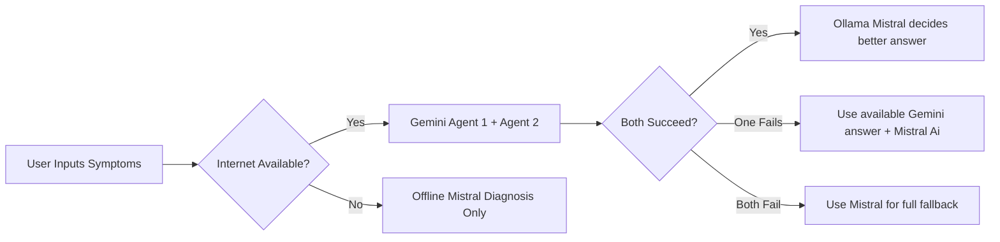

# 💊 Sympteller — Your AI Health Assistant

Sympteller is a hybrid AI-powered disease detection tool that intelligently analyzes user-provided symptoms using **Google Gemini (2 APIs)** and an **offline Mistral model** via **Ollama**. It works both **online and offline**, providing clean, confident diagnoses with no unnecessary disclaimers.

---

## ⚙️ How It Works


---

## 🧠 Features

✅ Dual Gemini 2.5 API calls for higher reliability
✅ Smart voting via Ollama (Mistral) adjudication
✅ 100% Offline fallback when no internet
✅ Flask backend + Beautiful animated HTML frontend
✅ Dark mode, glowing diagnosis cards, and responsive design

---

## 🖼️ Frontend UI


---
## 📂 Project Structure
```graphql
Sympteller/
├── Sympteller_code.py   # AI logic integrating Gemini APIs + Mistral model
├── app.py              # Flask backend API (POST /diagnose endpoint)
├── index3.html         # Frontend HTML interface with modern UI design
├── requirements.txt    # Python dependencies (Flask, requests, flask-cors, etc.)
└── README.md           # Project documentation
```
---
## 🚀 Getting Started

1️⃣ **Clone the repository:**
    ``` 
    git clone [https://github.com/proxymaster356/sympteller.git](https://github.com/proxymaster356/sympteller.git)
    ```

2️⃣ **Navigate into the project directory:**
    ``` 
    cd sympteller
    ```

3️⃣ **Install Project Requirements:**
    Navigate into the directory where your Python dependencies are located , then install them:
    ```pip install -r requirements.txt
    ```

4️⃣ **Start Ollama with Mistral:**
    Make sure you have [Ollama](https://ollama.ai/download) installed on your system. Once installed, start the Mistral model by running:
    ```  
    ollama run mistral     
    ```
   to exit from mistral ollama use "/bye" 
This will download and run the Mistral model locally, which is crucial for the AI adjudication and offline fallback features.


**to find out the mistral server http . Quit ollama, then in cmd type "ollama serve". It will show the address . IF not same, then change it with OLLAMA_BASE_URL = 'http://127.0.0.1:11434'. with cmd http address in Sympteller_code.py 

5️⃣ **Run the Flask Backend:**
    start the Flask application:
    ```
    python app.py
    ```
   This will start the backend server, typically accessible at `http://127.0.0.1:5000` (or `localhost:5000`).

6️⃣ **Open the Frontend:**
    **(Serve via Flask - Recommended for development):** If `app.py` is configured to serve static files, the frontend might be accessible directly through the Flask server. Once the Flask backend is running, open your web browser and navigate to:
        ```
        [http://127.0.0.1:5000/](http://127.0.0.1:5000/)
        ```
        *(This assumes `app.py` is set up to serve `index3.html` as its root or a specific route.)*

or Directly open the index3.html to get the view

--- 
## 🧠 Powered By
    🌐 Google Gemini 2.5
    🧠 Ollama + Mistral
    🖥️ Flask + HTML/CSS + JavaScript
---
## 🙋‍♂️ Developer
Debopam Dutta
Student @ UEM Kolkata | Tech + AI Enthusiast
Connect on [LinkedIn](https://www.linkedin.com/in/debopam-dutta-bb220b323/)| [Instagram](https://www.instagram.com/dutta_debopam/)

---
## Ok !! Goodbye and Thank You! 👋


