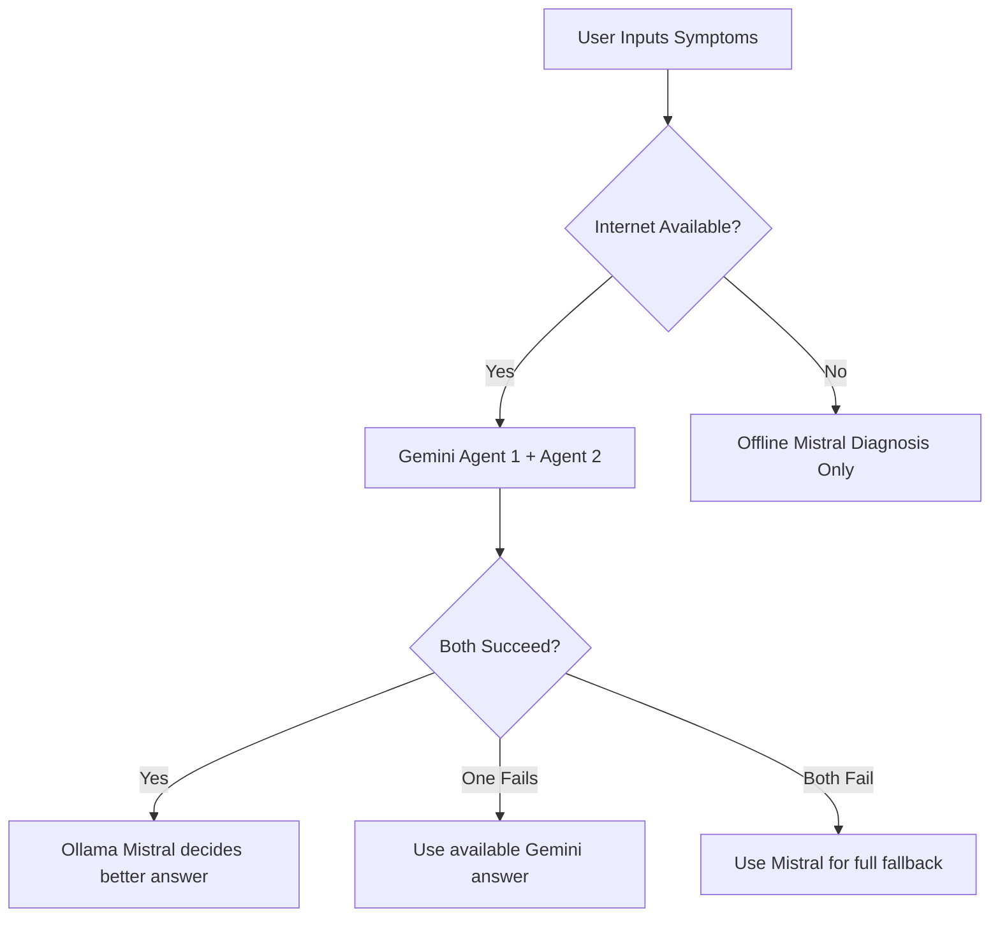

# 💊 Sympteller — Your AI Health Assistant

Sympteller is a hybrid AI-powered disease detection tool that intelligently analyzes user-provided symptoms using **Google Gemini (2 APIs)** and an **offline Mistral model** via **Ollama**. It works both **online and offline**, providing clean, confident diagnoses with no unnecessary disclaimers.

---

## ⚙️ How It Works

🧠 Features
✅ Dual Gemini 2.5 API calls for higher reliability
✅ Smart voting via Ollama (Mistral) adjudication
✅ 100% Offline fallback when no internet
✅ Flask backend + Beautiful animated HTML frontend
✅ Dark mode, glowing diagnosis cards, and responsive design

---

## 🖼️ Frontend UI

---

📂 Project Structure
graphql
Copy
Edit
/Sympteller
├── Sympteller_code.py       # AI logic with Gemini + Mistral
├── app.py                   # Flask API (POST /diagnose)
├── index3.html              # Frontend HTML interface (modern UI)
├── requirements.txt         # Python dependencies (Flask, requests, CORS)
└── README.md                # Project documentation
